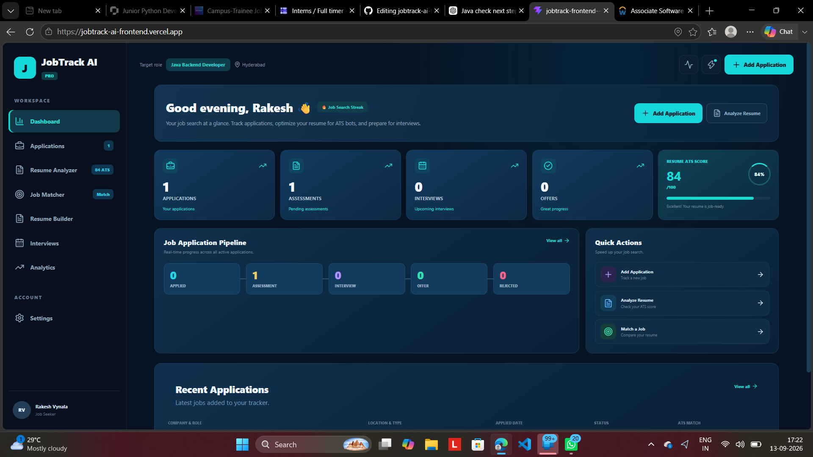
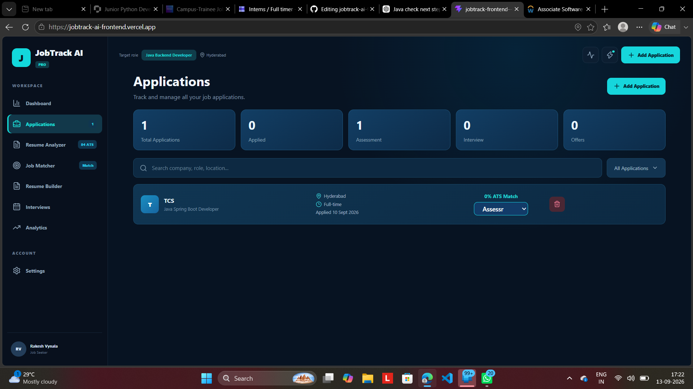
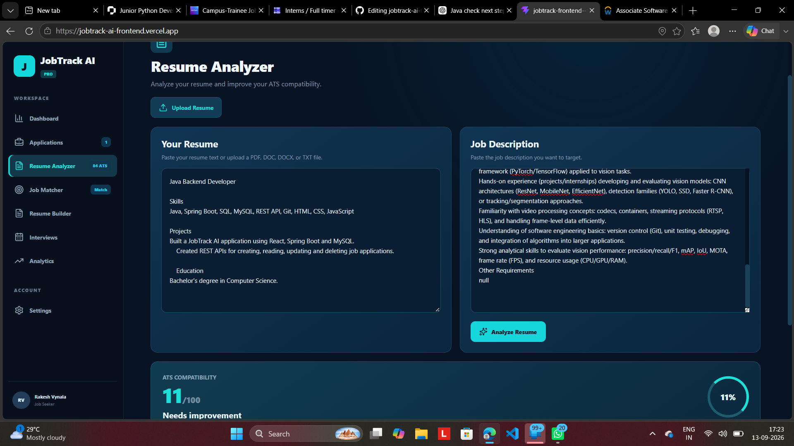
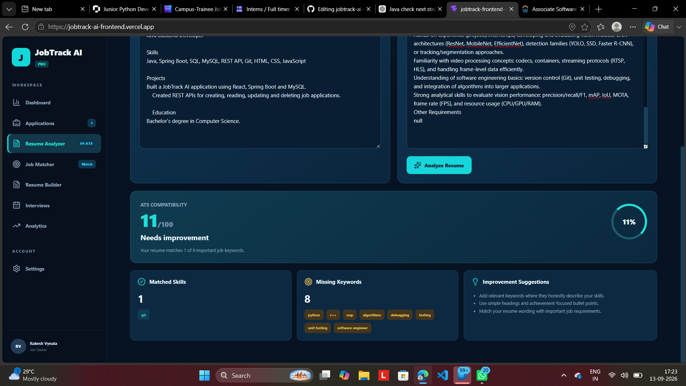
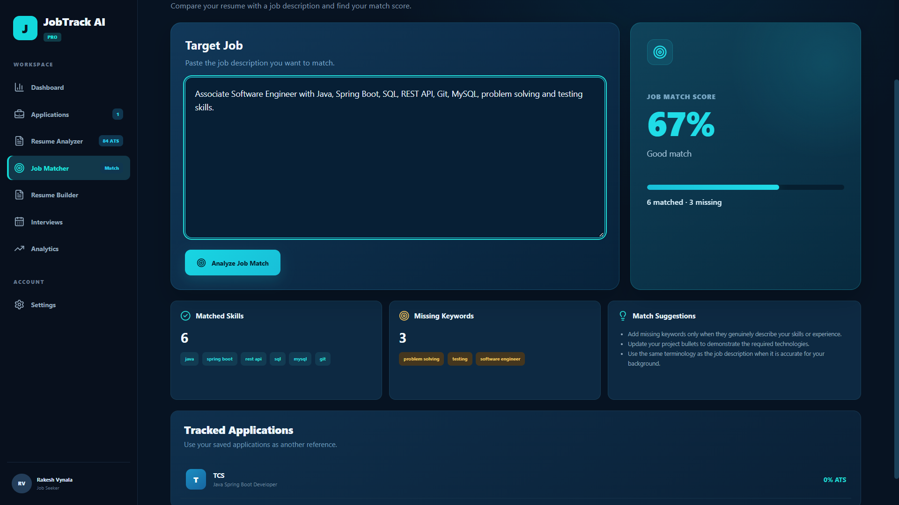
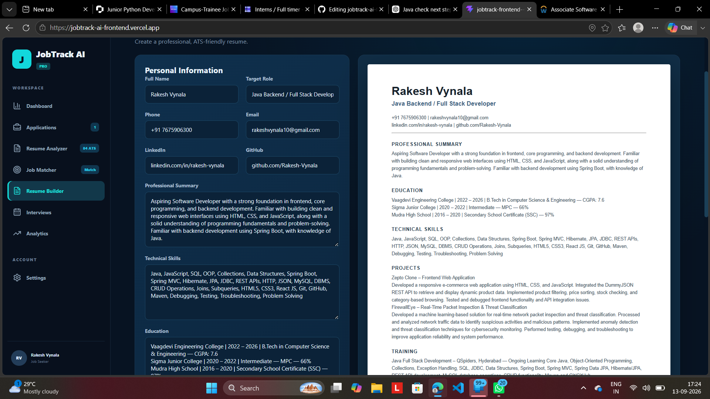
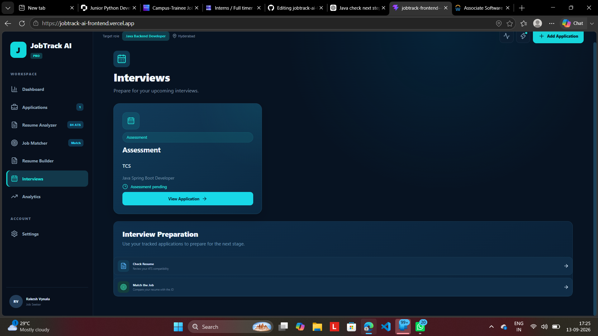
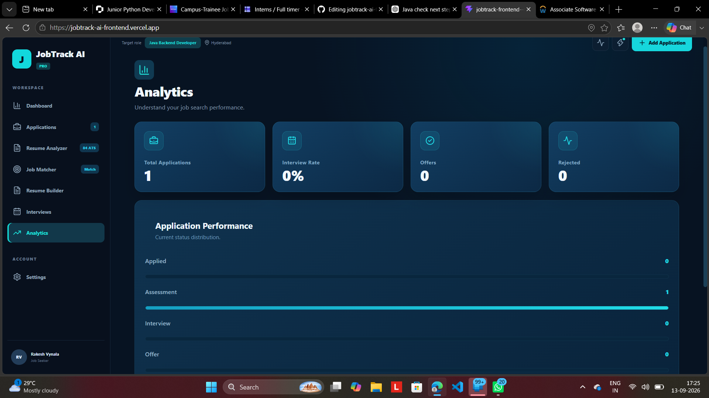
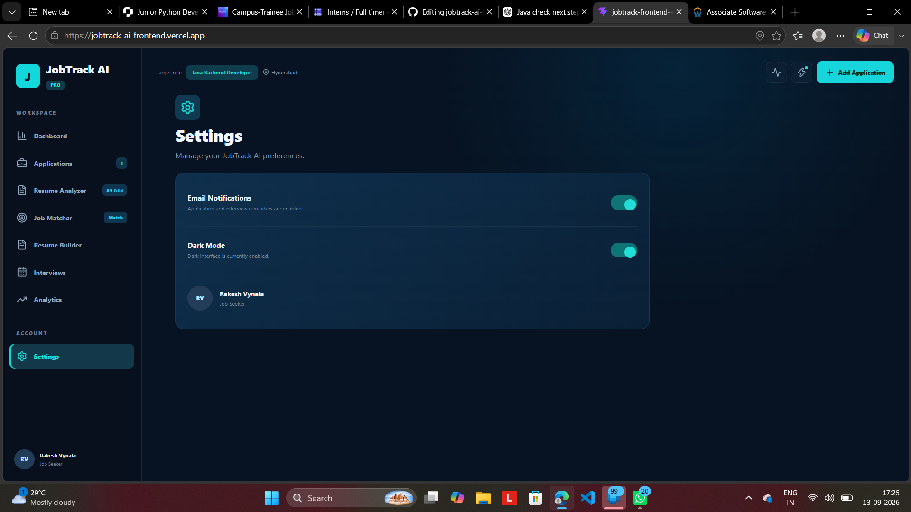

# JobTrack AI — Frontend

JobTrack AI is an AI-powered job application and career management platform built with React.js. It helps job seekers manage applications, analyze resumes, match resumes with job descriptions, build resumes, track interviews, and monitor their job search progress from a single platform.

This repository contains the **React.js frontend** of the application. The frontend communicates with a separate Spring Boot backend through REST APIs.

---

## 🚀 Live Demo

**Live Application:**  
https://jobtrack-ai-frontend.vercel.app/

**Backend API:**  
https://jobtrack-ai-backend-production.up.railway.app/

---

## 🔗 Project Repositories

**Frontend Repository:**  
https://github.com/Rakhi1018/jobtrack-ai-frontend

**Backend Repository:**  
https://github.com/Rakhi1018/jobtrack-ai-backend

---

## ✨ Features

---

## 📸 Application Screenshots

### 📊 Dashboard

The dashboard provides an overview of job applications, assessments, interviews, offers, resume ATS score, application pipeline, and recent applications.



---

### 💼 Job Application Management

Manage job applications by adding, searching, updating application status, and deleting applications.



---

### 🤖 Resume Analyzer

Analyze a resume against a job description and evaluate ATS compatibility using relevant job keywords.



---

### 📋 Resume Analysis Results

View ATS compatibility, matched skills, missing keywords, and improvement suggestions generated from the resume analysis.



---

### 🎯 Job Matcher

Compare your resume with a target job description to identify matched skills, missing skills, and overall job match percentage.



---

### 📄 Resume Builder

Create a professional ATS-friendly resume with personal details, summary, technical skills, education, projects, training, and achievements.



---

### 🎤 Interview Tracking

Track assessment and interview-related applications and access resume checking and job matching for interview preparation.



---

### 📈 Analytics

Monitor job search performance through application statistics, interview rate, offers, rejected applications, and application performance.



---

### ⚙️ Settings

Manage application preferences such as email notifications and dark mode.



---
---

## 🛠️ Tech Stack

### Frontend

- React.js
- JavaScript (ES6)
- HTML5
- CSS3
- Vite
- Lucide React
- REST API
- JSON

### Backend Integration

- Java
- Spring Boot
- Spring Data JPA
- Hibernate
- REST APIs

### Database

- MySQL

### AI Integration

- OpenAI API

### Deployment

- Vercel
- Railway

### Development Tools

- Git
- GitHub
- IntelliJ IDEA
- VS Code
- MySQL Workbench

---

## 🏗️ Application Architecture

```text
                         JobTrack AI
                              |
                              ▼
                    ┌──────────────────┐
                    │    React.js      │
                    │     Frontend     │
                    │      Vercel      │
                    └────────┬─────────┘
                             |
                       REST API / JSON
                             |
                             ▼
                    ┌──────────────────┐
                    │   Spring Boot    │
                    │     Backend      │
                    │     Railway      │
                    └────────┬─────────┘
                             |
                   ┌─────────┴─────────┐
                   │                   │
                   ▼                   ▼
             ┌───────────┐       ┌───────────┐
             │   MySQL   │       │  OpenAI   │
             │  Database │       │    API    │
             │  Railway  │       │    AI     │
             └───────────┘       └───────────┘
```

---

## 🔄 Frontend Data Flow

```text
User
  ↓
React.js Interface
  ↓
REST API Request
  ↓
Spring Boot Backend
  ↓
MySQL / OpenAI API
  ↓
Backend Response
  ↓
React.js
  ↓
Updated User Interface
```

---

## 🤖 AI Resume Analysis Flow

```text
Resume
   +
Job Description
       ↓
React.js Frontend
       ↓
Spring Boot Backend
       ↓
OpenAI API
       ↓
AI Analysis
       ↓
Spring Boot Backend
       ↓
React.js Frontend
       ↓
ATS Score
Matched Skills
Missing Skills
Resume Strengths
Resume Weaknesses
Suggestions
Keywords
```

The frontend does not directly expose the OpenAI API key. AI requests are sent through the Spring Boot backend.

---

## 🔌 Backend API Integration

The frontend communicates with the Spring Boot backend using REST APIs.

### Job Application APIs

```text
GET     /api/jobs
POST    /api/jobs
PUT     /api/jobs/{id}
DELETE  /api/jobs/{id}
```

### AI Resume Analysis API

```text
POST    /api/ai/analyze
```

---

## 🌐 Production API Endpoints

### Job Applications

```text
https://jobtrack-ai-backend-production.up.railway.app/api/jobs
```

### AI Resume Analysis

```text
https://jobtrack-ai-backend-production.up.railway.app/api/ai/analyze
```

---

## ⚙️ Environment Variables

The frontend uses Vite environment variables to configure the backend API URL.

Create a `.env` file in the project root:

```env
VITE_API_URL=http://localhost:8080/api/jobs
```

For the deployed backend:

```env
VITE_API_URL=https://jobtrack-ai-backend-production.up.railway.app/api/jobs
```

The `.env` file is excluded from version control.

---

## 💻 Installation and Local Setup

### Prerequisites

Make sure the following are installed:

- Node.js
- npm
- Git

### Step 1 — Clone the Repository

```bash
git clone https://github.com/Rakhi1018/jobtrack-ai-frontend.git
```

### Step 2 — Open the Project

```bash
cd jobtrack-ai-frontend
```

### Step 3 — Install Dependencies

```bash
npm install
```

### Step 4 — Configure the Backend URL

Create a `.env` file in the project root:

```env
VITE_API_URL=http://localhost:8080/api/jobs
```

### Step 5 — Start the Development Server

```bash
npm run dev
```

The application will normally be available at:

```text
http://localhost:5173
```

The Spring Boot backend must also be running if you are using the local backend.

---

## 📦 Build for Production

Create an optimized production build:

```bash
npm run build
```

Preview the production build locally:

```bash
npm run preview
```

---

## ☁️ Deployment

The frontend is deployed using **Vercel**.

```text
GitHub Repository
        ↓
      Vercel
        ↓
React + Vite Application
        ↓
Production Frontend
```

The backend and MySQL database are deployed separately using Railway.

```text
React Frontend
     ↓
   Vercel
     ↓
Spring Boot Backend
     ↓
  Railway
     ↓
    MySQL
```

### Production Frontend

```text
https://jobtrack-ai-frontend.vercel.app/
```

### Production Backend

```text
https://jobtrack-ai-backend-production.up.railway.app/
```

---

## 🔐 Security

- OpenAI API credentials are handled by the backend.
- OpenAI API keys are not exposed directly in the frontend.
- Environment variables are used for API configuration.
- `.env` files are excluded from version control.
- Sensitive credentials should never be committed to GitHub.

---

## 📁 Repository Structure

```text
jobtrack-ai-frontend/
│
├── public/
│
├── src/
│   ├── assets/
│   ├── App.jsx
│   ├── main.jsx
│   └── ...
│
├── .gitignore
├── index.html
├── package.json
├── package-lock.json
├── vite.config.js
└── README.md
```

---

## 🔗 Related Backend Repository

The Spring Boot backend is maintained in a separate repository.

```text
https://github.com/Rakhi1018/jobtrack-ai-backend
```

The backend handles:

- REST APIs
- Job application CRUD operations
- MySQL database communication
- OpenAI API integration
- CORS configuration
- Production deployment

---

## 🌍 Production Architecture

```text
                        USER
                          |
                          ▼
                ┌───────────────────┐
                │   React Frontend  │
                │      Vercel       │
                └─────────┬─────────┘
                          |
                          | HTTPS / REST API
                          ▼
                ┌───────────────────┐
                │  Spring Boot API  │
                │      Railway      │
                └─────────┬─────────┘
                          |
                 ┌────────┴────────┐
                 │                 │
                 ▼                 ▼
          ┌─────────────┐   ┌─────────────┐
          │    MySQL    │   │   OpenAI    │
          │   Railway   │   │     API     │
          └─────────────┘   └─────────────┘
```

---

## 📌 Project Highlights

- Developed a complete **React.js frontend** for a full-stack job management platform.
- Integrated REST APIs with a **Java Spring Boot backend**.
- Implemented job application management with database-backed operations.
- Integrated **OpenAI-powered resume analysis** through the backend.
- Built resume builder, job matching, interview tracking, dashboard, and analytics features.
- Connected the frontend with a **MySQL-backed production backend**.
- Deployed the production frontend using **Vercel**.
- Connected the Vercel frontend with the Spring Boot backend deployed on **Railway**.

---

## 👨‍💻 Author

**Rakesh Vynala**

Computer Science & Engineering Graduate

**GitHub:**  
https://github.com/Rakhi1018

---

## 📄 License

This project is developed for educational, portfolio, and demonstration purposes.
